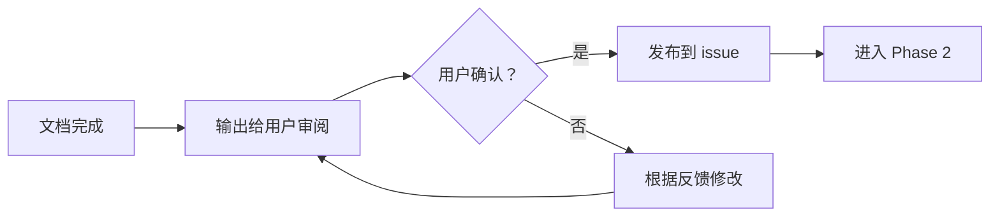
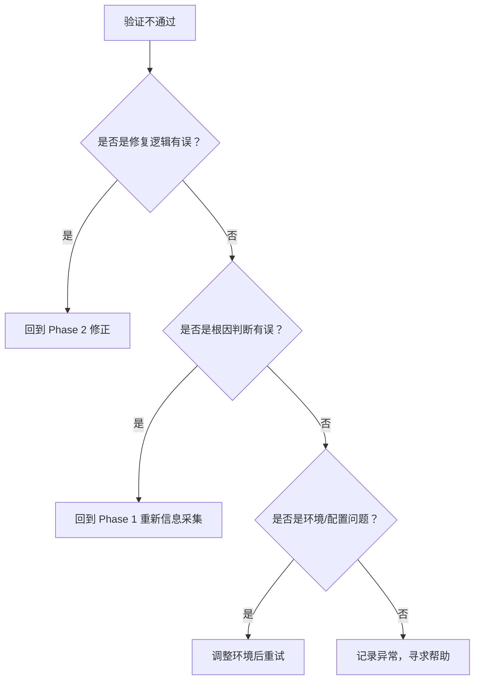

# Dev Cycle — 四阶段开发/修复流程

## 适用场景

当你接到以下类型的任务时，启用本 skill：

- **修 Bug** — 用户报告了一个问题，需要定位根因并修复
- **开发功能** — 需要实现一个新功能
- **重构/迁移** — 需要改动现有代码结构
- **排查问题** — 用户反馈现象模糊，需要先弄清楚发生了什么

---

## 核心信念

> **信息深度决定结果质量。**
>
> 绝大多数失败的修复，根因不是写错了代码，而是信息没挖到位。
> 表面信息指向表面原因，深度信息指向根本原因。
>
> 本流程的强制要求：
> 1. **不只信用户说的** — 用户说的现象是线索，不是答案
> 2. **不只一轮收集** — 信息是分层的，第一轮只能摸到表层
> 3. **不只一种来源** — 代码、网络、日志、git 历史、文档——每种来源看到的是不同的切面
> 4. **不只单向追踪** — 既要顺藤摸瓜，也要广撒网多捕鱼
> 5. **保持质疑** — 对每个"看起来对了"的判断，用工具验证它

---

## 四阶段总览

```
┌────────────────────────────────────────────────────────────┐
│  Phase 1: 前期处理（信息采集与分析）                        │
│  耗时占比 ≈ 50%                                           │
│  目标：定位根因 / 确定方案                                 │
│  产出：根因结论 + 修复/实现方案                            │
├────────────────────────────────────────────────────────────┤
│  Phase 2: 开发/修复（编码实现）                             │
│  耗时占比 ≈ 30%                                           │
│  目标：实现方案                                           │
│  产出：可运行的代码                                       │
├────────────────────────────────────────────────────────────┤
│  Phase 3: 验证测试                                        │
│  耗时占比 ≈ 15%                                           │
│  目标：验证方案正确性                                     │
│  产出：测试通过的结论                                      │
├────────────────────────────────────────────────────────────┤
│  Phase 4: 收尾                                            │
│  耗时占比 ≈ 5%                                            │
│  目标：提交、记录、关闭                                     │
│  产出：PR / 文档 / 关闭的 issue                            │
└────────────────────────────────────────────────────────────┘
```

> **不要跳过 Phase 1。** 如果用户说"这个 bug 很简单，直接改"，**先做信息采集再评估**。
> 看起来简单的 bug 往往意味着你没看到完整图景。

---

## Phase 1: 前期处理（信息采集与分析）

### 1.0 初始信息摄入

从任务描述中提取初始信息，建立**信息采集索引**：

```markdown
## 信息采集索引（初始）

### 任务描述
{用户/任务的原始描述}

### 已知线索
- 现象: {问题表现}
- 平台: {Android / iOS / JVM / Web}
- 触发条件: {什么情况下出现}
- 相关文件/模块: {用户提到的文件或模块}
- 日志/错误: {已有的日志或错误信息}

### 信息缺口（待填充）
- {列出已知缺失的信息项}
```

这个索引会在整个 Phase 1 中持续更新。

---

### 1.1 第一轮信息收集：广撒网

> **目标：** 获取尽可能多的关联线索，不设限，不预判。

#### 信息源清单（每项都要执行，不留死角）

| # | 信息源 | 工具/方法 | 目的是什么 |
|---|--------|----------|-----------|
| 1 | **项目源码** | Read 相关文件 | 理解代码逻辑、找到问题代码位置 |
| 2 | **Git 提交历史** | `git log --oneline --since=...` `git blame <file>` | 最近的改动是否引入了问题 |
| 3 | **Git 分支** | `git branch --all` `git diff dev..main` | 当前分支与主分支的差异 |
| 4 | **外部网络搜索** | WebSearch | 类似 case、最佳实践、已知 bug |
| 5 | **官方文档** | WebFetch / context7 查文档 | 库/框架的正确用法、已知限制 |
| 6 | **项目依赖** | `libs.versions.toml` 及相关构建文件 | 依赖版本是否过旧、是否有已知漏洞 |
| 7 | **Issue 追踪** | `gh issue list --search` | 是否有相同/类似的 issue |
| 8 | **错误日志/堆栈** | 日志文件、crash 报告 | 精确的错误位置和类型 |
| 9 | **设备/环境日志** | `adb logcat` / 系统日志 | 运行时上下文 |
| 10 | **测试用例** | 项目中的测试文件 | 是否有相关测试、是否覆盖了该场景 |

#### 执行策略

**不要按顺序线性执行，而是并发发散：**

```
用户描述的 Bug 现象
      │
      ├─→ Read 相关源码        → 找到疑似代码区域
      ├─→ WebSearch 类似 case  → 找到社区方案
      ├─→ git blame 该区域     → 找到最近改动
      ├─→ 查依赖版本           → 是否与版本有关
      └─→ 查现有 issues        → 是否已有报告
```

每一条线索都是独立的，不要等到一条线走完再走下一条。**并发发出去，哪条线先出结果就先分析哪条。**

#### 第一轮输出的信息索引示例

```markdown
## 信息采集索引（第一轮后）

### 源码线索
- `lplayer/.../MediaPlayerService.kt:42` — startForeground() 调用处
- 调用时序: onStartCommand() → startForeground() 中间隔了一个网络请求

### Git 线索
- commit 7a8b9c0 (3 days ago) — "refactor MediaPlayerService lifecycle"
- blame 定位到 startForeground() 那行是本次改动的

### 网络搜索线索
- StackOverflow: "ForegroundServiceDidNotStartInTimeException" — timeout 是 5s
- 官方文档: startForeground() 必须在 onStartCommand() 返回后的 5s 内调用

### 依赖线索
- 无异常

### Issue 线索
- #1 Windows 卸载删除目录（无关）
- 无相关 issue

### 日志线索
- crash log 显示 ANR 发生在主线程 IO 操作后
```

---

### 1.2 第二轮信息收集：顺藤摸瓜

> **目标：** 根据第一轮的发现，深入挖掘深层关联。

第一轮收集到的信息不是终点，而是新的起点。每个线索都可能引出更深的发现：

```
第一轮发现的线索
      │
      ├─→ 类 A 调用了类 B  → Read 类 B → 发现 B 也有类似问题
      ├─→ 网络搜索找到一个  → 文中提到了某个库 → 去查该库的
      │   workaround                        官方文档确认方案
      ├─→ git blame 指向     → git show <commit> → 发现这次提交
      │   某次提交                             只改了部分调用，遗漏了另一处
      └─→ crash 栈指向       → 反查该类的调用方 → 发现上游传入了 null
          方法 A                                  但方法 A 没做空检查
```

#### 第二轮执行规范

| 场景 | 你的操作 |
|------|---------|
| 源码中发现了可疑方法 | 读完整方法体 → 读其调用方 → 读其被调用方 → 读其所在的类完整结构 |
| 网络搜索找到一个相关 case | 通读全文 → 提取关键词 → 用新关键词再搜索 → 找到更多关联资料 |
| git blame 指向某次提交 | `git show <commit>` 看完整 diff → 看这次提交涉及的其他文件是否也有问题 |
| crash 栈中有一个异常类 | 搜索该异常类的常见触发原因 → 对照源码看是否符合 |
| 文档中提到某个 API 有 deprecated | 搜索项目中对这个 API 的所有引用 → 逐一检查是否需要更新 |

**关键判断：什么时候可以停止深入？**

```
继续深入的条件：
✅ 当前线索指向了一个未探索的领域（新类、新模块、新概念）
✅ 当前线索解释了现象但无法解释全部（说明还有别的因素）
✅ 当前线索与其他线索存在矛盾（需要解决矛盾）
✅ 当前线索指向了一个已知的坑（需要确认是否踩了）

可以停止深入的条件：
✅ 一条线索已经追溯到框架/系统调用（无法再深入）
✅ 一条线索已经追溯到外部依赖行为（读文档确认即可）
✅ 多条独立线索都指向同一个根因（交叉验证完成）
✅ 当前线索与问题无关（放弃，不浪费精力）
```

---

### 1.3 广撒网策略：定期发散检查

> **顺藤摸瓜容易陷入一条线走到黑。定期做发散检查，确保没有遗漏其他维度。**

在 Phase 1 中，每深入追踪 2-3 层后，强制停下来做一次广撒网检查：

```markdown
## 广撒网检查清单

□ 我有没有只在一个信息源里打转？（源码→源码→源码→...）
  → 切换到另一个信息源：去搜一下社区有没有人遇到过，或看文档怎么说

□ 我找到的根因能解释用户报告的**所有**现象吗？
  → 如有不能解释的，说明还有未发现的根因

□ 有没有其他模块也可能受影响？
  → 检查调用链上涉及的其他组件

□ 有没有其他平台也可能有同样问题？
  → KMP 项目要特别检查：这个 bug 在 Android 有，iOS 上是否也存在？

□ 有没有什么是我假设了但没验证的？
  → 再读一遍代码确认假设成立
```

---

### 1.4 关联判断与产出文档

> **不要等到写代码了再验证方案。在 Phase 1 就要确认方向正确。**

信息收集完成后，根据任务类型输出对应的文档。**文档完成后才能进入 Phase 2。**

#### 分支一：修 Bug → 根因分析报告

```markdown
## 根因分析报告

### 根因结论
{一句话描述根因，如："MediaPlayerService.onStartCommand() 中的网络 IO 
阻塞了主线程，导致 startForeground() 未在 5s 内被调用"}

### 现象（用户看到的）
{用户报告的现象}

### 证据链
1. 现象 → 证据: {日志/截图/用户描述}
2. 代码定位 → 证据: {源码片段或文件引用}  ← 精确到行号
3. 触发路径 → 证据: {逐层引用的文件和方法}  ← 完整调用链
4. 根因确认 → 证据: {交叉验证的结果}

### 已排除的候选根因
- {候选根因 A} → 排除理由: {为什么不是它}
- {候选根因 B} → 排除理由: {为什么不是它}

### 修复方案
{简述修复思路}

### 影响范围
- 涉及文件: {文件列表}
- 涉及平台: {平台列表}
- 涉及模块: {模块列表}
- 需要同步检查: {是否有其他类似模式需要一并修复}

### 可用工具验证
{列出可以在不改代码的情况下验证根因判断的方法，
 如: 加日志、用 adb 模拟场景、查测试用例}
```

> **修 Bug 场景的 Phase 1 出口问题：**
> - 问题出在哪里？（精确到文件和行号）
> - 为什么会出问题？（完整的原因链条）
> - 受影响的完整范围是什么？（文件、模块、平台）
> - 修复方案是什么？（思路 + 涉及的改动点）
> - 这个判断能用什么工具验证？

#### 分支二：开发 Feature → 需求理解与开发实施文档

```markdown
## 需求理解与开发实施文档

### 需求概述
{用户/任务想要什么，用一句话说清楚}

### 需求拆解
- 核心目标: {这个 feature 要解决的核心问题是什么}
- 用户场景: {用户在什么场景下使用、操作流程是什么}
- 成功标准: {怎么算"做完了"，可验证的标准}

### 关联分析
- 涉及现有模块: {需要改动的模块}
- 涉及新模块: {需要新建的模块或文件}
- 依赖关系: {上游依赖、下游影响、外部依赖}
- 平台影响: {Android / iOS / JVM / Web 各平台是否需要分别处理}

### 技术方案
- 架构方向: {整体方案描述}
- 接口设计: {关键 API / 数据模型 / 协议定义}
- 关键路径: {核心逻辑的实现思路}
- 备选方案: {有其他方案吗？为什么选当前这个}

### 边界与约束
- 已知约束: {时间、性能、兼容性等硬性约束}
- 边界情况: {空状态、异常流、极限值}
- 未覆盖场景: {本次不做、留待后续的}

### 实施计划
- [ ] Step 1: {第一个可验证的里程碑}
- [ ] Step 2: {第二步}
- [ ] Step 3: {第三步}
- [ ] 平台验证: {各平台的适配工作清单}

### 参考资源
- {相关文档链接}
- {相关的现有代码示例}
- {外部参考资料}
```

> **开发 Feature 场景的 Phase 1 出口问题：**
> - 这个 feature 要解决什么问题？（不是"做什么"，是"为什么做"）
> - 用户怎么用？（完整的操作流程）
> - 涉及哪些现有代码？（文件、模块、数据流）
> - 技术方案是否可行？（关键路径走了至少一遍源码验证）
> - 哪些平台需要分别处理？

#### 交叉验证方法（通用，两类场景都适用）

| 验证方法 | 适用场景 | 操作 |
|---------|---------|------|
| **代码再读** | 所有场景 | 再读一遍关键代码路径，确认理解无误 |
| **git blame 链** | 怀疑近期引入 | 沿 blame 链追溯，确认是谁在什么时候引入了问题 |
| **搜索项目内相似模式** | 怀疑是普遍问题 | 搜同类 API 调用 / 同类写法，看其他位置是否也有同样隐患 |
| **日志加读** | 不确定运行时行为 | 查看设备日志中关键路径的打印 |
| **文档对照** | 不确定 API 语义 | 读官方文档确认 API 的契约和约束 |
| **小实验验证** | 不确定某段代码的行为 | 写一个最小验证片段（或直接在脑子里模拟执行） |

### 1.5 文档确认与发布到 Issue

> **用户确认文档内容后，沉淀到对应的 issue 中，作为可追溯的分析记录。**

文档完成后，不要直接进入 Phase 2。先输出给用户审阅，确认无误后发布。

#### 操作流程



#### 发布方法

**固定标题：**
```
## 📋 前期分析报告
```
以此标题作为标识，用于检测是否已发布过。

**发布逻辑（有则更新，无则新增）：**

```bash
# 1. 先获取 issue 现有的所有评论
gh issue view <number> --repo cy745/LMusic-KMP --json comments --jq '.comments[] | select(.body | startswith("## 📋 前期分析报告")) | .id, .url'
```

```bash
# 2. 如果找到匹配的评论 → 用 API 更新（不新增）
# 假设评论 ID 是 123456789
gh api -X PATCH /repos/{owner}/{repo}/issues/comments/123456789 \
  --field body=@/tmp/analysis-doc.md

# 3. 如果没有找到 → 新建评论
gh issue comment <number> --repo cy745/LMusic-KMP --body-file /tmp/analysis-doc.md
```

**合并后的伪代码逻辑：**

```
def publish_document(issue_number, document_path):
    # 用固定标题头检测是否已存在
    existing = gh issue view <number> --repo cy745/LMusic-KMP \
        --json comments --jq '[.comments[] | select(.body | startswith("## 📋 前期分析报告")) | .id] | first'
    
    if existing:
        # 更新已有评论
        gh api -X PATCH /repos/cy745/LMusic-KMP/issues/comments/{existing.id} \
          --field body=@document_path
    else:
        # 新建评论
        gh issue comment <number> --repo cy745/LMusic-KMP --body-file=document_path
```

#### 评论格式

在 issue 评论中，文档加一个醒目的标题头，方便后续翻阅时快速定位：

```markdown
## 📋 前期分析报告

> 生成时间: {datetime}
> 类型: {根因分析报告 / 需求理解与开发实施文档}
> 状态: 用户已确认

{文档完整内容}
```

#### 为什么要这样做？

| 好处 | 说明 |
|------|------|
| **可追溯** | 任何时候回看 issue，都能知道当时分析的完整思路 |
| **可协作** | 协作者看到 issue 可以直接在分析文档下讨论，不用另起炉灶 |
| **可积累** | 多个 issue 的分析文档形成项目知识库，后续类似问题可以直接参考 |
| **可验证** | 修复完成后，对照分析文档可以确认是否真正解决了根因 |

#### 发布禁令

> ⚠️ 以下规则是**硬性要求**，违反可能导致敏感信息泄露。

| 禁令 | 说明 |
|------|------|
| ❌ **禁止引用私有会话** | 不得在 issue 中出现"分析详情见会话记录""见聊天记录"等指向私有对话的表述。会话记录仅当前 Agent 和用户可见，其他协作者无法访问 |
| ❌ **禁止上传敏感信息** | 密钥、证书、Token、密码、内部 API Key 等不得出现在 issue body 或评论中。仓库是公开的（`cy745/LMusic-KMP` 为公开仓库） |
| ❌ **禁止上传本地路径** | 用户的本地文件路径（如 `/Users/xxx/`）不应直接出现在 issue 中，需脱敏处理 |

#### 发布前检查清单

在调用 `gh issue comment` 或 `gh api PATCH` 前，逐项检查文档内容：

- [ ] 没有"分析详情见会话记录"/"见聊天记录"等私有引用
- [ ] 没有 API Key / Token / 密码 / 证书内容
- [ ] 没有本地绝对路径（如 `/Users/xxx/`、`C:\Users\xxx\`）
- [ ] 没有 internal-only 的 URL / IP 地址
- [ ] 所有代码片段已确认不包含敏感注释

> **一条原则：** issue 内容是公开的，发出去的每一句话都假设整个互联网能看到。写完之后先问自己：这段话我能贴到公司门口公告栏上吗？

---

## Phase 2: 开发/修复（编码实现）

### 2.1 前提条件

**进入 Phase 2 前必须完成（根据任务类型选择对应检查项）：**

**修 Bug 场景：**
- [ ] 根因分析报告已完成
- [ ] 根因已通过交叉验证
- [ ] 用户已确认文档内容
- [ ] 文档已发布到对应 issue（评论形式）
- [ ] 修复方案已有明确的思路
- [ ] 影响范围已确认
- [ ] 涉及的代码文件已完整阅读

**开发 Feature 场景：**
- [ ] 需求理解与开发实施文档已完成
- [ ] 技术方案已走查验证（至少读了一遍关键路径的源码）
- [ ] 用户已确认文档内容
- [ ] 文档已发布到对应 issue（如无 issue 则先创建）
- [ ] 边界与约束已明确
- [ ] 实施计划步骤清晰可执行

### 2.2 不在真空中编码

> Phase 1 的信息收集结束了，不代表编码时可以闭门造车。
> 编码过程中同样可能需要外部信息的输入。

**编码过程中可能需要做的信息获取：**

| 场景 | 你的操作 |
|------|---------|
| 不确定某个 API 的正确用法 | 查官方文档确认，不要猜 |
| 不确定当前写法是否是常见做法 | 搜社区示例 / 最佳实践对比 |
| 遇到一个没预料到的编译/运行时错误 | 搜错误信息，确认是否是已知问题 |
| 不确定某种设计在当前场景下是否合适 | 看项目中其他类似场景是怎么做的 |

> **关键区别：** Phase 1 的信息收集是为了「弄清楚要改什么」，Phase 2 的信息收集是为了「确保改得对、改得好」。前者是方向性的，后者是质量性的。

### 2.3 质量原则：不止是跑通

> **跑通是最低标准，不是交付标准。**

每次改动完成后，用以下三个维度审视：

| 维度 | Bug 修复 | Feature 开发 | 架构设计 |
|------|----------|-------------|---------|
| **可维护性** | ✅ **必须考虑** | ✅ **必须考虑** | ✅ **必须考虑** |
| **可读性** | ✅ **必须考虑** | ✅ **必须考虑** | ✅ **必须考虑** |
| **扩展性** | ❌ **不考虑** | ⚠️ **适度考虑** | ✅ **核心考量** |

**详解：**

- **可维护性** — 改完后别人（或三个月后的你）看这段代码，能不能快速理解意图？逻辑是否清晰？异常路径是否处理了？
- **可读性** — 命名是否表意？有没有多余的复杂度？注释说明的是"为什么"而不是"是什么"？
- **扩展性（仅架构设计/Feature 开发时考虑）** — 是否预留了扩展点？接口是否抽象合理？**修 Bug 时绝对不考虑扩展性，不要为了"以后可能"而引入抽象。**

> **修 Bug 的黄金法则：** 只改根因，不引入抽象。用最简单直接的方式修复，用可读性保证质量，用测试保证正确性。如果有人问你"为什么不用设计模式"，回答是"因为这是个 bug fix，不是架构设计"。

### 2.4 每一个改动都要有价值

> **不要为了不同而不同。不要为了"现代化"而引入新写法。**

编码时始终问自己三个问题：

```
1. 这个改动有实际价值吗？
   → 它解决了什么问题？有没有更简单的做法能达到同样的效果？

2. 这个改动有意义吗？
   → 它让代码更好维护了，还是只是"看起来更酷"？
   → 新引入的写法/模式，项目里有没有其他地方在用？
   → 如果只有这里用了新写法，以后的人维护时会不会困惑？

3. 这个改动保持了风格一致吗？
   → 如果项目里其他类似场景用的是回调，不要在这里改成 Flow
   → 如果项目里用的是 Data Class + Sealed Class，不要在这里引入 Either/Arrow
   → 如果项目里不用某设计模式，不要在这里第一个用
```

> **一致性优于时髦。** 项目中已有的做法即使不是最前沿的，也比混入一种只有你懂的新做法要好。维护者不需要猜测"这里为什么写法不一样"。

### 2.5 编码规范

| 原则 | 说明 |
|------|------|
| **最小改动** | 只改必须改的地方。不要顺手重构无关代码 |
| **保持风格一致** | 代码风格、命名、注释密度与周围代码一致。不做项目里没有先例的事 |
| **有疑问就问** | 不确定这么做是否合适时，看看项目其他地方是怎么做的。参考 > 发明 |
| **边界处理** | 每次改动都问自己：边界情况是什么？异常路径是什么？ |
| **不留 TODO** | 要么现在修，要么建一个新 issue 跟踪，不留 `// TODO` 在代码里 |
| **平台兼容** | KMP 项目特别注意 `expect/actual` 同步更新 |
| **提交粒度** | 每完成一个逻辑独立的改动就 commit，不攒一大坨 |

### 2.6 代码改动清单

每次改动后记录：

```markdown
## 改动清单
- [ ] {文件路径}: {改了什么}
- [ ] {文件路径}: {改了什么}
```

---

## Phase 3: 验证测试

### 3.1 构建验证

```bash
# Android
./gradlew :composeApp:assembleDebug

# iOS (macOS)
./gradlew :composeApp:iosSimulatorArm64MainBinaries

# 桌面端
./gradlew :composeApp:run

# Web
./gradlew :composeApp:wasmJsBrowserRun

# 全平台编译检查（推荐）
./gradlew allTargetsCompile
```

### 3.2 功能验证清单

| 验证项 | 说明 |
|-------|------|
| **主场景验证** | 修复的功能在正常情况下是否工作 |
| **边界场景验证** | 空数据、异常输入、极限值时是否正常 |
| **回退验证** | 撤修复后问题是否复现 — 确认修复真的有效 |
| **回归验证** | 修复是否影响了其他功能 |
| **平台验证** | 改动是否在所有平台上都能编译通过 |
| **性能验证** | 如果涉及性能敏感路径，确认没有退化 |

### 3.3 验证不通过时的决策



---

## Phase 4: 收尾

### 4.1 代码提交

```bash
git add <files>
git commit -m "<type>: <简明的改动描述>"
```

**提交信息规范：**
```
<type>: <简洁描述>

<详细说明（可选）>

Close #<issue-number>
```

| type | 场景 |
|------|------|
| `fix` | 修 Bug |
| `feat` | 新功能 |
| `refactor` | 重构 |
| `chore` | 构建/配置/依赖改动 |
| `docs` | 文档 |
| `test` | 测试 |

### 4.2 Issue 更新

- 在 issue 下评论，说明修复内容
- 关闭 issue（或标记为待验证）
- 如果创建了 follow-up issue，在评论中关联

### 4.3 知识沉淀

如果这次修复中发现了有价值的信息（常见的坑、特别的调试技巧、架构决策），记录到项目 memory 中：

```markdown
---
name: dev-tip-{简短描述}
description: {一句话总结这个经验}
metadata:
  type: reference
---

## 经验记录: {标题}

### 背景
{什么场景下发现的}

### 结论
{最终确定的方案或根因}

### 为什么值得记录
{这个经验对其他人的价值}
```

---

## 决策速查

| 场景 | 行为 |
|------|------|
| "修一下这个 bug" | 进入 Phase 1 信息采集 |
| "实现这个功能" | 进入 Phase 1（前期分析） |
| "这个 bug 很简单直接改" | 仍然走 Phase 1，至少做一轮信息采集确认真的是小问题 |
| "排查一下为什么 xxx" | 进入 Phase 1，重点在信息收集和关联判断 |
| 信息采集发现和预期不一样 | 不要强行适配预期，以采集到的信息为准修正方向 |
| 采集了两轮还没头绪 | 停下来，整理已知线索，换一个信息源试试 |
| 找到了根因但改起来风险大 | 在 Phase 2 前先做影响范围评估和回退方案 |
| 文档已完成，用户确认 | 先发布到对应 issue，再进入 Phase 2 |
| 编码时想用新写法/新库 | 停下来问：项目里有先例吗？没有就不要用。一致性 > 时髦 |
| "顺便重构一下旁边的代码" | **禁止。** 只改必须改的地方。想重构就另建 issue |
| 验证不通过 | 按验证阶段的决策树处理 |

---

## 与 issues-tracker skill 的协作

| 场景 | 用哪个 skill |
|------|-------------|
| 用户说要创建一个 issue | issues-tracker |
| 用户说"看看项目进度" | issues-tracker |
| 用户说"修复这个 bug" | dev-cycle（跟踪用 issues-tracker） |
| 用户说"实现这个功能" | dev-cycle（计划用 issues-tracker 创建 task） |
| 修复完成后 | 回到 issues-tracker 更新/关闭对应 issue |

两个 skill 配合使用：**issues-tracker 管「记什么」，dev-cycle 管「怎么做」**。
